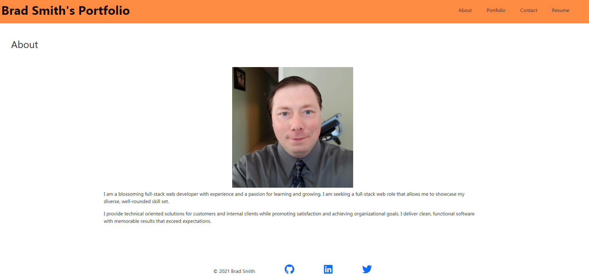

# React Portfolio
Update portfolio with more relevant technologies

## Description:
React app with updated skills and resume

##Motivation for development?

I wanted to demonstrate some of my more recently aquired skills. I will continue to update this portfolio.

## Functionality and Features:
More recent projects with links to GitHub Repos and deployed apps. 
Build with react, bootstrap 5, and form validation on the contact page 

## Technologies:

This MERN app runs in the browser and features:

* REACT
* Bootstrap 5
* Deployed to GitHub Pages

## Links: 

Github Repo: https://github.com/smithfamily42/react-portfolio

deployed app: https://smithfamily42.github.io/react-portfolio/

## Future Development
Adding animations React-reveal
Adding email capabilities to the contact page
Update styling
Improve navigation
Provide links to demonstrate skills in Resume page

### License
MIT License is used for this project. 

### Badges
